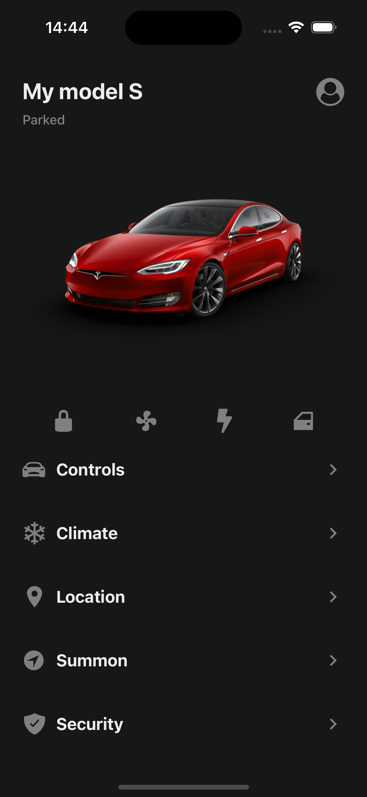
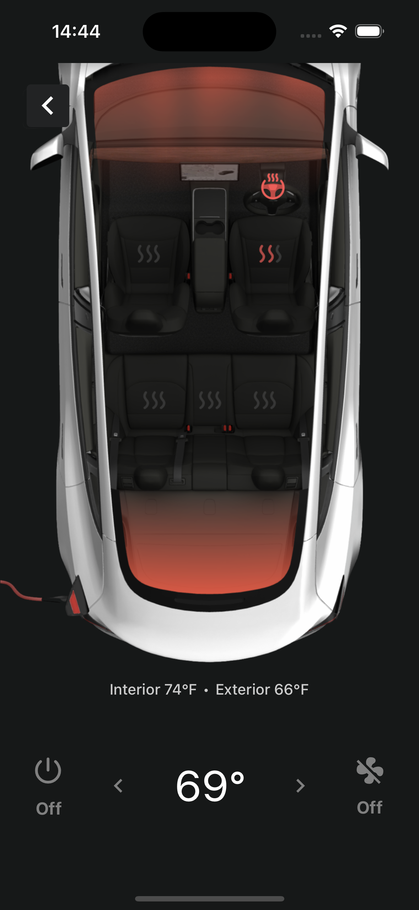

# Tesla App Clone

Este projeto é um clone do aplicativo para controle de carros Tesla, desenvolvido usando React Native e Expo. O objetivo principal deste projeto é fornecer uma oportunidade de estudo e prática de desenvolvimento de aplicativos móveis usando tecnologias modernas.

### Tela Home

A tela Home é a tela inicial do aplicativo Tesla Car Control. Ela exibe informações relevantes sobre o carro. Além disso, a tela Home também possui controles para interagir com o carro Tesla, como destravamento de portas e controle de janelas. No entanto, vale ressaltar que, nesse clone do aplicativo, apenas o controle de clima está funcional. Essa tela oferece uma visão geral do estado do veículo e permite ao usuário realizar algumas ações básicas de controle.



### Tela Climate

A tela Climate é acessada a partir da tela Home, ao interagir com o controle de clima. Nessa tela, o usuário pode ajustar a temperatura interna do veículo, bem como controlar a velocidade dos ventiladores. É uma tela voltada para a configuração e controle do sistema de climatização do carro Tesla.



## Tecnologias Utilizadas

- React Native: React Native é um framework JavaScript utilizado para o desenvolvimento de aplicativos móveis multiplataforma. Ele permite criar aplicativos nativos para iOS e Android usando componentes reutilizáveis e uma sintaxe familiar do React.
- Expo: Expo é uma plataforma e conjunto de ferramentas que simplificam o desenvolvimento de aplicativos móveis usando React Native. Ele fornece uma série de APIs e componentes pré-construídos, além de facilitar a implantação e o teste do aplicativo em dispositivos físicos ou emuladores.
- Expo Routes: Expo Routes é uma biblioteca que fornece um sistema de navegação para aplicativos React Native. Ela permite criar rotas e navegar entre diferentes telas dentro do aplicativo, facilitando a organização e a estruturação do fluxo de navegação.
- Typescript: TypeScript é uma linguagem de programação que estende o JavaScript adicionando tipos estáticos opcionais. Ela melhora a experiência de desenvolvimento, fornecendo recursos avançados de tipagem, detecção de erros e autocompletar, garantindo maior segurança e produtividade durante o desenvolvimento do aplicativo.

## Rodando o Projeto

### Pré-requisitos

Antes de começar, verifique se você possui as seguintes ferramentas instaladas em seu sistema:

- [Node.js](https://nodejs.org) - Certifique-se de ter a versão LTS (Long Term Supported) instalada.
- [Expo CLI](https://docs.expo.dev/bare/using-expo-cli/) - Instale o Expo CLI globalmente em seu sistema executando o seguinte comando no terminal:
```
npx install-expo-modules@latest
```

- Um emulador ou um dispositivo físico configurado para executar o aplicativo.

### Configuração do Projeto

1. Clone ou faça o download do projeto para o seu sistema.
2. Navegue até o diretório do projeto no terminal
3. Instale as dependências do projeto usando o comando:
```
npm install
```

### Executando o Projeto

1. Para iniciar o servidor de desenvolvimento, utilize o comando:
```
expo start
```

2. O Expo irá abrir uma página no seu navegador com um código QR. Você pode escanear esse código QR utilizando o aplicativo Expo Go no seu dispositivo móvel, ou executar o aplicativo em um emulador.

3. Se você possui um dispositivo físico, certifique-se de que ele está conectado ao mesmo rede local que o seu computador e utilize o aplicativo Expo Go para escanear o código QR.

4. Se você estiver usando um emulador, escolha a opção adequada na página Expo no navegador para abrir o aplicativo no emulador.

5. O servidor de desenvolvimento do Expo irá compilar e instalar o aplicativo no dispositivo selecionado ou no emulador. Agora você poderá ver e testar o aplicativo React Native.

Happy Hacking :)

## Licença

Este projeto está licenciado sob a [MIT License](https://github.com/GuMarques/tesla-clone-app/blob/main/LICENSE).
